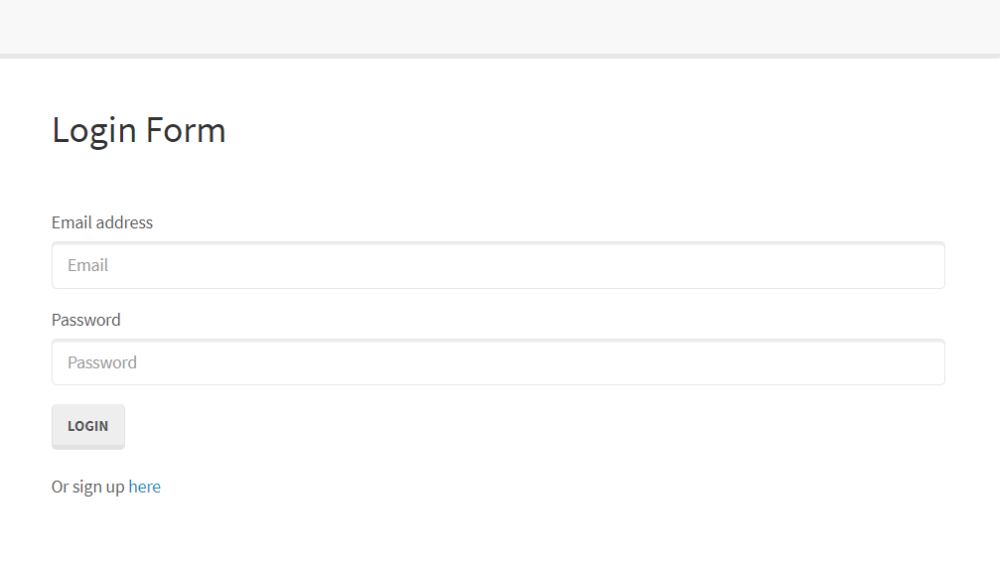

# Reverse Engineering Code

This application allows users to create an account with an email and password, log into the account, and sign out. 


## File Explanations

CONFIG
* `config.json` connection configuration that connects to the server.

* `passport.js` is telling passport that we want to use a Local Strategy. In other words, we want to login with a username/email and password.

MIDDLEWARE

* `isAuthenticated.js` restricts routes that user is not allowed to visit if not logged in. if user is logged in, it continues with request.


MODELS

`index.js` imports user login data by connecting to database.

`user.js` with requiring bcrypt install, this makes the database secure.

PUBLIC

`login.html`, `members.html`, `signup.html` shows how each page will be displayed on the website.

JS

* `login.js` validates the email and password entered.

* `members.js` figures out which user is logged in and updates the HTML on the page.

* `signups.js` validates the email and password are not blank and redirects the user to the members page.

STYLESHEETS

* `style.css` creates styling for the html page.

ROUTES

* `api-routes.js` contains routes for user specific data to be displayed such as signing in and logging out.

* `html-routes.js` directs user to the appropriate html page.

`package.json` contains all necessary package information, node modules required, and version information needed to run the application.

`server.js` requires the necessary npm packages, sets up port and requiring models for syncing, creates express app and configuring middleware needed for authentication, creates routes, and logs message when successfully connected to server.


<br>

## Application Tutorial

Follow the necessary steps below to open the application:

1. Go into the `config.json` file and update your password in line 4

2. Navigate to MySQL Workbench and enter create the database query below

    ```
    CREATE DATABASE passport_demo;
    ```
3. Execute the script in MySQL Workbench and refresh the schemas database

4. Right click on your `server.js` file in the Explorer and select `"Open In Intergrated Terminal"`

5. Run `npm install` or `npm install bcryptjs express express-session mysql2 passport passport-local sequelize` to install all the required dependencies

6. Once the dependencies have been installed, run `node server.js` in the intergrated terminal

7. The following successfully executed message below will show in your terminal

    ```
    Listening on port 8080. Visit http://localhost:8080/ in your browser
    ```

8. To access the link, Ctrl + click the link or copy and paste the link to your browser

<br>

### Updates/Changes
Feel free to navigate to the [GitHub Repository Link here](https://github.com/christyglee/reverse-engineering-code) to clone and make changes and updates to this project!

<br>


<br>



<br>


<br>
<br>

## Powered By

* [Javascript](https://developer.mozilla.org/en-US/docs/Web/JavaScript)
* [Node.js](https://nodejs.org/en/)
* [npm install](https://nodejs.org/en/)
* [bcryptjs nodejs](https://www.npmjs.com/package/bcryptjs)
* [express nodejs](https://www.npmjs.com/package/express)
* [express-session nodejs](https://www.npmjs.com/package/express-session)
* [passport nodejs](https://www.npmjs.com/package/passport)
* [passport-local nodejs](https://www.npmjs.com/package/passport-local)
* [sequelize nodejs](https://www.npmjs.com/package/sequelize)
* [mysql2 nodejs](https://www.npmjs.com/package/mysql2)


<br>

### Other Resources Used

* [Visual Studio Code](https://code.visualstudio.com/)
    * [How to install VS Code](https://code.visualstudio.com/docs/setup/setup-overview)
* [GitBash](https://gitforwindows.org/)
    * [Download GitBash for Windows](https://git-scm.com/downloads)
* [MySQL](https://www.mysql.com/)
    * [Download MySQL](https://dev.mysql.com/downloads/mysql/)

<br>

## Author
**Christy Lee** 

- [Github](https://github.com/christyglee)
- [LinkedIn](https://www.linkedin.com/in/christy-g-lee/)

<br> 

## Acknowledgments

* [Google-Fu](https://www.google.com)
* [w3schools](https://www.w3schools.com/)
* [Stack Overflow](https://stackoverflow.com/search?q=over)
* [Node.js](https://nodejs.org/en/)
* [npm install](https://nodejs.org/en/)
* [MySQL](https://www.mysql.com/)
